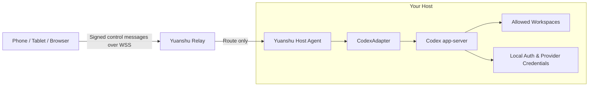

# Yuanshu · 远枢

> Open-source remote workspace for local AI coding agents.

[English](./README.md) | [简体中文](./README.zh-CN.md)

Yuanshu is being built for developers who want to control AI coding agents running on their own computers from a phone, tablet, or browser. It focuses on structured agent activity—threads, streaming output, commands, diffs, approvals, and task state—instead of forwarding an entire desktop.

The name **远枢** combines “remote” (远) and “hub/pivot” (枢): a remote control hub for the machines and agents you already use.

> [!IMPORTANT]
> Yuanshu is currently in pre-alpha design and technical validation. There is no installable release yet. Do not use the project to expose a development machine to the public internet.

## Why Yuanshu?

- **One controller, many hosts** — Follow work across a personal PC, work machine, always-on computer, or development server from one interface.
- **Authentication-neutral** — Reuse the Codex setup already working on each host, whether it uses ChatGPT sign-in, an API key, or a supported custom provider.
- **Local execution and credentials** — Model requests, source code, shell access, Git/SSH credentials, and agent authentication stay on the host.
- **Agent-native remote experience** — Display task state, streamed events, approvals, commands, and diffs instead of mirroring a desktop.
- **Open and self-hostable** — The host agent, relay, protocol, web client, and adapters are intended to remain auditable and self-hostable.
- **Designed to grow beyond one agent** — The first adapter targets Codex app-server; additional local coding agents can be added through explicit capability adapters.

## Planned personal MVP

The first usable version is intentionally focused:

- One owner controlling 1–5 hosts;
- Windows 11 x64 host first;
- Codex app-server integration;
- Local workspace allowlist;
- Create, list, read, and resume threads;
- Stream agent messages, commands, tool activity, file changes, and diffs;
- Steer or interrupt an active turn;
- Review and resolve approvals from a mobile-friendly PWA;
- Signed control messages verified by the host;
- Host-side event journal, reconnect, replay, and snapshot recovery;
- A small self-hosted relay using outbound HTTPS/WSS connections.

Team roles, hosted compute, remote desktop, a general-purpose web terminal, and permanent cloud storage of task content are deliberately outside the first MVP.

## Architecture direction

The relay coordinates connections and routes structured messages. The host remains the final enforcement point for trusted controllers, workspace boundaries, sandbox policy, and approvals. Yuanshu does not proxy model API traffic or manage model credentials.

## Project status

- [x] Product scope and architecture baseline
- [x] Personal-first, one-to-many-host direction
- [x] Authentication-neutral Codex positioning
- [ ] Codex app-server proof of concept
- [ ] Cross-language protocol and signed-control test vectors
- [ ] Windows host agent alpha
- [ ] Self-hosted relay and device pairing
- [ ] Mobile PWA task loop
- [ ] Security hardening and first public preview

The roadmap favors a reliable daily-use loop for one developer before adding more operating systems, agent adapters, or team features.

## Security principles

Yuanshu is designed around a high-trust local execution environment and a minimally trusted relay:

- Host and control clients use independent device identities;
- Control operations and approval decisions are signed end to end and revalidated by the host;
- Remote clients cannot choose arbitrary local paths;
- The relay does not permanently store prompts, responses, command output, diffs, or source code;
- ChatGPT tokens, API keys, provider keys, and Git/SSH credentials must never be uploaded to Yuanshu;
- Ambiguous operations after a crash must not be silently replayed.

These are design goals until the corresponding implementation and security tests land. A formal security policy and private reporting channel will be published before the first executable release.

## Contributing

Yuanshu is at an early stage, so focused feedback is especially useful. Good first contributions include:

- Codex app-server compatibility findings;
- Windows host lifecycle experiments;
- Protocol and threat-model review;
- Mobile task and approval UX proposals;
- Self-hosting feedback;
- Research on the next operating system or agent adapter.

Please use GitHub Issues for reproducible bugs, scoped proposals, and design discussion. Avoid posting credentials, private source code, or security vulnerabilities in public issues.

Contribution guidelines and a security reporting process will be added as the implementation begins.

## License

Yuanshu is licensed under the [Apache License 2.0](./LICENSE).

## Acknowledgements

The initial integration is designed around the open-source [OpenAI Codex](https://github.com/openai/codex) app-server protocol.

Yuanshu is an independent open-source project and is not affiliated with or endorsed by OpenAI. Product and company names are trademarks of their respective owners.
