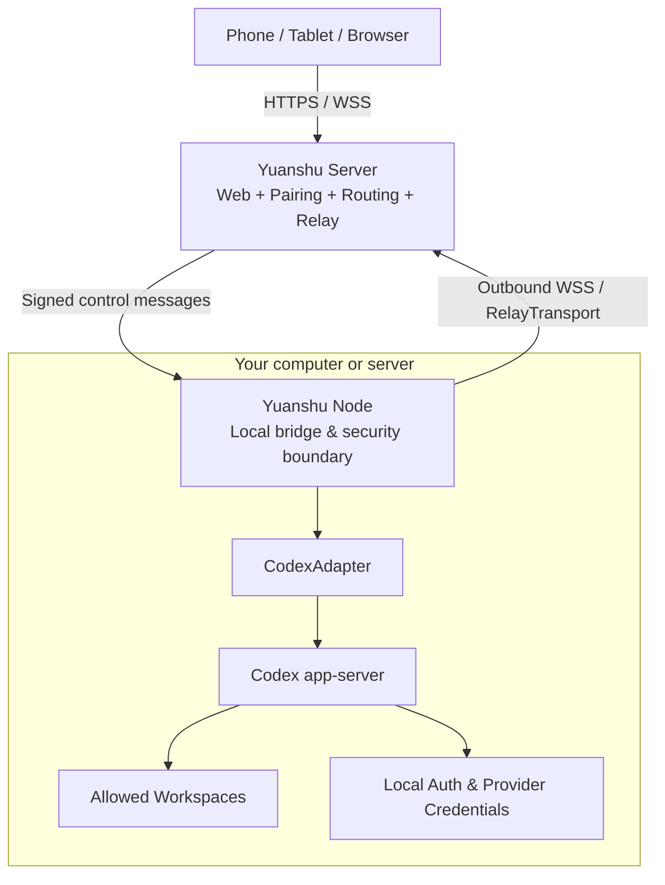

# Yuanshu · 远枢

> Open-source remote workspace for local AI coding agents.

[English](./README.md) | [简体中文](./README.zh-CN.md)

[](./LICENSE)
[](#project-status)

Yuanshu is being built for developers who want to control AI coding agents running on their own computers from a phone, tablet, or browser. It focuses on structured agent activity—threads, streaming output, commands, diffs, approvals, and task state—instead of forwarding an entire desktop.

The name **远枢** combines “remote” (远) and “hub/pivot” (枢): a remote control hub for the machines and agents you already use.

> [!IMPORTANT]
> Yuanshu is currently in pre-alpha design and technical validation. There is no installable release yet. Do not use the project to expose a development machine to the public internet.

## Why Yuanshu?

- **One controller, many nodes** — Follow work across a personal PC, work machine, always-on computer, or development server from one interface.
- **Authentication-neutral** — Reuse the Codex setup already working on each node machine, whether it uses ChatGPT sign-in, an API key, or a supported custom provider.
- **Local execution and credentials** — Model requests, source code, shell access, Git/SSH credentials, and agent authentication stay on the node machine.
- **Agent-native remote experience** — Display task state, streamed events, approvals, commands, and diffs instead of mirroring a desktop.
- **Open and self-hostable** — Yuanshu Node, Server, Web, protocol, and adapters are intended to remain auditable and self-hostable.
- **Designed to grow beyond one agent** — The first adapter targets Codex app-server; additional local coding agents can be added through explicit capability adapters.

## Planned personal MVP

The first usable version is intentionally focused:

- One owner controlling 1–5 Yuanshu Nodes;
- Windows 11 x64 Node first;
- Linux amd64 Server and Standalone as the initial self-hosting target;
- Codex app-server integration;
- Local workspace allowlist;
- Create, list, read, and resume threads;
- Stream agent messages, commands, tool activity, file changes, and diffs;
- Steer or interrupt an active turn;
- Review and resolve approvals from a mobile-friendly PWA;
- Signed control messages verified by the Node;
- Node-side event journal, reconnect, replay, and snapshot recovery;
- Standard Server + Node and single-deployment Standalone modes;
- Outbound-only HTTPS/WSS connections for ordinary Node machines.

Team roles, hosted compute, remote desktop, a general-purpose web terminal, and permanent cloud storage of task content are deliberately outside the first MVP.

## Platform roadmap

Windows, macOS, and Linux are all first-class product targets. The order is phased to keep the first release achievable:

1. Windows 11 x64 Yuanshu Node;
2. Linux amd64 Yuanshu Server and Standalone;
3. Linux amd64 Yuanshu Node;
4. macOS arm64 Yuanshu Node;
5. macOS amd64 and Linux arm64 builds based on actual usage.

The protocol, transports, adapters, configuration model, and event journal will share one Go implementation. Platform-specific code is limited to secure storage, IPC, process lifecycle, autostart, path validation, and release signing. The project prefers pure-Go dependencies; introducing CGO requires an explicit cross-platform build and supply-chain review.

## Architecture direction



Yuanshu has four logical components: the Agent Runtime (Codex first, Claude Code later), Yuanshu Node, Yuanshu Server, and the browser/PWA Control Client. The Server provides Web, pairing, registry, routing, and relay capabilities. The Node remains the final enforcement point for trusted controllers, workspace boundaries, sandbox policy, and approvals.

The planned runtime modes are:

```text
yuanshu server       Web, control plane, and relay
yuanshu node         Local bridge connecting an Agent Runtime to a Server
yuanshu standalone   Server + Web + local Node in one deployment
```

These commands currently expose only the disposable, loopback-only M0 engineering PoC when every required `YUANSHU_POC_*` setting is supplied. Without explicit configuration they fail closed. This is not the personal MVP, a production deployment, or a stable protocol. On a cloud server that also runs Codex or another supported agent, the planned deployment needs only one Standalone process and no second relay service. Standalone still routes local Agent access through the Node module, so Server code cannot bypass local policy and approvals. Codex app-server and other agents' internal interfaces must never be exposed directly to the public internet.

## Project status

- [x] Product scope and architecture baseline
- [x] Personal-first, one-to-many-Node direction
- [x] Authentication-neutral Codex positioning
- [x] Buildable workspace, placeholder CLI, Web scaffold, and base CI
- [x] M0 Codex app-server and minimal vertical proof of concept
- [x] Protocol v1 Schema, generated Go/TypeScript types, and compatibility fixtures
- [ ] Signed-control encoding and cross-language test vectors
- [ ] Windows Yuanshu Node alpha
- [ ] Linux Server and Standalone self-hosting preview
- [ ] Self-hosted device and control-client pairing
- [ ] Linux Yuanshu Node
- [ ] macOS arm64 Yuanshu Node
- [ ] Mobile PWA task loop
- [ ] Security hardening and first public preview

The roadmap establishes a reliable daily-use loop for one developer first, then completes the committed Linux and macOS integrations before expanding into more agent adapters or team features.

## Development

The repository now contains the temporary `m0-poc-1` Gate G0 implementation. It is for local engineering validation only and intentionally omits formal pairing, signed controls, persistence, production certificates, and the stable Adapter API.

Prerequisites:

- Go 1.26.5;
- Node.js 24.18.1;
- pnpm 11.18.0 through Corepack.

Install the Web dependencies from the repository root:

```shell
corepack enable
corepack install --global pnpm@11.18.0
pnpm install --frozen-lockfile
```

Run the local verification suite:

```shell
go test ./...
go vet ./...
go build ./...
pnpm --dir web test
pnpm --dir web build
```

The formal Protocol v1 Schema is the sole wire-type source. Regenerate and verify the committed Go/TypeScript types with:

```shell
pnpm protocol:generate
pnpm protocol:check
pnpm protocol:test
```

Protocol generation requires both Node.js and Go (`gofmt`) and is deterministic on Windows, macOS, and Linux. The temporary `m0-poc-1` frames are intentionally separate from Protocol v1.

Inspect the CLI without starting any service:

```shell
go run ./cmd/yuanshu --help
go run ./cmd/yuanshu server --help
go run ./cmd/yuanshu node --help
go run ./cmd/yuanshu standalone --help
```

The repository uses LF source files and supports these commands on Windows, macOS, and Linux. The base CI currently runs Go checks on Windows and Linux and Web checks on Ubuntu; broader release matrices belong to later tasks.

### M0 PoC (developers only)

The PoC supports `server`, `node`, and `standalone` only with explicit temporary configuration:

```text
YUANSHU_POC_LISTEN=127.0.0.1:7443
YUANSHU_POC_TLS_CERT=<localhost certificate PEM>
YUANSHU_POC_TLS_KEY=<localhost private key PEM>
YUANSHU_POC_NODE_TOKEN=<at least 32 random bytes>
YUANSHU_POC_SERVER_URL=wss://localhost:7443
YUANSHU_POC_WORKSPACE=<existing non-root disposable directory>
```

`YUANSHU_POC_ARCHIVE_ON_CLOSE=1` is reserved for bounded test runs. The Server rejects wildcard, LAN, and public listen addresses. Do not reuse the PoC token or development certificate, and do not expose this build outside loopback.

## Security principles

Yuanshu is designed around a high-trust local execution environment and a minimally trusted Server relay:

- Node and control clients use independent device identities;
- Control operations and approval decisions are signed end to end and revalidated by the Node;
- Remote clients cannot choose arbitrary local paths;
- The Server relay does not permanently store prompts, responses, command output, diffs, or source code;
- ChatGPT tokens, API keys, provider keys, and Git/SSH credentials must never be uploaded to Yuanshu;
- Ambiguous operations after a crash must not be silently replayed.

These are design goals until the corresponding implementation and security tests land. A formal security policy and private reporting channel will be published before the first executable release.

## Contributing

Yuanshu is at an early stage, so focused feedback is especially useful. Good first contributions include:

- Codex app-server compatibility findings;
- Windows, Linux, and macOS Node lifecycle experiments;
- Protocol and threat-model review;
- Mobile task and approval UX proposals;
- Self-hosting feedback;
- Cross-platform integration findings or research on the next agent adapter.

Please use GitHub Issues for reproducible bugs, scoped proposals, and design discussion. Avoid posting credentials, private source code, or security vulnerabilities in public issues.

Contribution guidelines and a security reporting process will be added as the implementation begins.

## License

Yuanshu is licensed under the [Apache License 2.0](./LICENSE).

## Acknowledgements

The initial integration is designed around the open-source [OpenAI Codex](https://github.com/openai/codex) app-server protocol.

Yuanshu is an independent open-source project and is not affiliated with or endorsed by OpenAI. Product and company names are trademarks of their respective owners.
