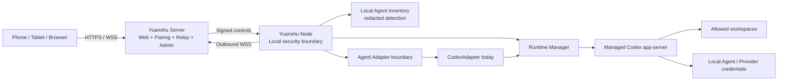

# Yuanshu · 远枢

<p align="center"></p>

> An open-source remote workbench for AI coding agents running on your own computers.

[English](./README.md) | [简体中文](./README.zh-CN.md)

[](./LICENSE)
[](#project-status)
[](https://github.com/yuanshu-ai/yuanshu/actions/workflows/ci.yml)

Yuanshu lets you follow and control Codex work running on your personal computers from a phone, tablet, or browser. It keeps the Codex environment you actually use—including API-key authentication, custom Base URLs, model-provider gateways, proxies, MCP servers, and local tools—on the Node machine. It presents agent-native state instead of mirroring an entire desktop.

Codex is the first complete integration. The long-term product is an open, self-hosted remote workbench for local coding agents, with future adapters planned for Claude Code, OpenCode, Gemini, Grok Build, Zcode, WorkBuddy, and other structured Agent runtimes.


| Mobile task home | Mobile task detail |
| --- | --- |
|  |  |

<!-- readme-section: status -->
## Project status

> [!WARNING]
> Yuanshu is **pre-alpha and source-build only**. There is no signed installer or supported production release. PF-052 real-device acceptance for macOS, Windows, iPhone, Android, iPad, and network switching is still in progress. Do not use the current build to expose a development machine directly to the public internet.

The implementation is usable for development and self-hosting evaluation. Automated Protocol, Web, Go, cross-build, replay, TLS, and certificate-provider tests are in place, but they do not replace real-device release acceptance.

<!-- readme-section: capabilities -->
## What works today

- One personal Owner can bind and switch between multiple Yuanshu Nodes.
- Windows and macOS Nodes run Codex app-server locally and keep Agent credentials on that machine.
- API-key and custom-Provider Codex setups keep their Base URL, authentication, proxy, MCP, and tool environment local while remaining controllable from the Web workbench.
- The mobile-first Web workbench can list workspaces and Threads, read history, stream events, start or steer Turns, and stop active work.
- Thread-scoped leases prevent two browsers from changing the same task at once.
- Signed approvals, command/tool activity, file changes, bounded Diff views, notifications, and reconnect recovery are implemented.
- Node event journals provide cursor replay, snapshots, history-gap recovery, and conservative handling of ambiguous operations.
- The Server embeds the workbench, pairing page, Relay, and same-origin administration console in one process.
- Four self-hosting modes cover loopback, managed LAN certificates, public-IP ACME, and existing certificates or a same-host reverse proxy.
- The Node now uses a static Adapter Registry, a redacted local Agent Inventory, and an isolated multi-runtime manager; the production path remains `codex-default` managed stdio.
- Evidence-only Claude Code and OpenCode probes are present for architecture validation, but they are not registered as production Adapters or exposed as remote task controls.

Yuanshu currently integrates Codex first. Its Server does not proxy model API calls or require the Agent to use a vendor-owned mobile-account path. It does not provide hosted compute, remote desktop, a general-purpose browser terminal, permanent Server-side task-content storage, team ACLs, or additional production Agent adapters yet.

<!-- readme-section: quick-start -->
## Quick start from source

### Prerequisites

- Go and Node.js versions capable of building the repository; the checked-in `.go-version` and `.node-version` record the currently verified toolchains.
- pnpm through Corepack.
- A working local Codex installation and authentication on every Node machine.
- A current-user session on Windows or macOS; do not run the Node as root, LocalSystem, or a system daemon.

Yuanshu does not reject Codex, Node.js, or browser versions merely because they are absent from a compatibility table. Unknown Codex versions are probed at runtime and reported as `unverified`, `partial`, or `unavailable` when capabilities differ.

### Build

```shell
git clone https://github.com/yuanshu-ai/yuanshu.git
cd yuanshu
corepack enable
pnpm install --frozen-lockfile
pnpm build
mkdir -p bin .local
go build -o ./bin/yuanshu ./cmd/yuanshu
```

On Windows, build `bin\yuanshu.exe` and use absolute Windows paths in the commands below.

### Try it on one computer

Run the local Server setup wizard and select `local`:

```shell
./bin/yuanshu server setup --config "$PWD/.local/server.toml"
./bin/yuanshu server --config "$PWD/.local/server.toml"
```

In another terminal, configure and start the Node:

```shell
./bin/yuanshu node setup
./bin/yuanshu node
```

The Server prints the local workbench, administration, pairing, and bootstrap addresses. Open `/pair`, approve the pairing from the trusted Node, select an allowed workspace, and create the first task.

Only literal `127.0.0.1` and `::1` may use HTTP/WS. Host and peer checks prevent this exception from being used by LAN or public clients.

### Use it from a phone on your LAN

Run `server setup`, select `lan-managed`, and choose the Server computer's stable private IP. Yuanshu creates a per-Server CA and an IP-SAN leaf certificate. Verify the displayed fingerprint, open `/trust` on each device, install the public root certificate, and then configure the Node with the same CA during `node setup`.

The CA private key never leaves the Server's private data directory. Read the [self-hosting and LAN TLS guide](./guides/self-hosting.md) before connecting another device.

<!-- readme-section: deployment -->
## Deployment modes

| Mode | Browser and Relay access | Certificate source | Intended use |
| --- | --- | --- | --- |
| `local` | Literal loopback HTTP/WS | None | One-computer evaluation and local settings |
| `lan-managed` | Private IP HTTPS/WSS | Per-Server managed CA | Home and office LAN; recommended for personal use |
| `public-ip-acme` | Public IP HTTPS/WSS | Automated short-lived ACME certificate | Fixed globally routable IP; staging acceptance still required |
| `external` | HTTPS/WSS | User certificate or same-host loopback reverse proxy | Domains, enterprise PKI, Caddy, or Nginx |

Remote access is TLS-only. Yuanshu never provides a switch to disable certificate or hostname validation, and Codex app-server is never exposed as a public endpoint.

<!-- readme-section: platforms -->
## Platform and acceptance matrix

| Target | Implementation | Automated evidence | Real-device/release evidence |
| --- | --- | --- | --- |
| Windows x64 Node | Implemented: DPAPI, Named Pipe, Job Object, native tray, user autostart | Native CI and cross-build coverage | PF-052 Windows daily-use acceptance pending |
| macOS arm64 Node | Implemented: Keychain, Unix IPC, process groups, AppKit menu, LaunchAgent | Native build and test coverage | PF-052 full Node/menu/LaunchAgent acceptance pending |
| Linux amd64 Server/Standalone | Implemented and buildable | Linux tests, race suite, container and cross-build coverage | Real self-hosted phone deployment pending |
| Linux Node | Platform boundaries exist | Contract coverage | Not a supported general Node yet |
| Mobile Web workbench | Implemented for responsive browsers | Chromium/WebKit viewport and workflow tests | Real Safari, Android Chrome, and iPad acceptance pending |
| Public-IP ACME | Implemented with TLS-ALPN-01 and renewal | Controlled ACME/provider tests | Real staging and production issuance pending |

This matrix deliberately distinguishes implementation and automated tests from real-device acceptance. See the [Codex compatibility matrix](./guides/codex-compatibility.md) for tested combinations; it is guidance, not a runtime allowlist.

<!-- readme-section: architecture -->
## How it works



The Server authenticates identities, manages personal routing and leases, and relays immutable Protocol v1 frames. It never bypasses the Node to control an Agent Runtime. The Node remains the final enforcement point for controller signatures, replay protection, workspace IDs, local paths, permissions, approvals, and Agent process ownership.

Yuanshu ships one binary with three entry points:

```text
yuanshu server       Web, pairing, administration, control plane, and Relay
yuanshu node         Local bridge and Agent security boundary
yuanshu standalone   Server + Web + local Node in one deployment
```

<!-- readme-section: data-boundaries -->
## Security and data boundaries

| Data | Node machine | Server | Browser |
| --- | --- | --- | --- |
| Agent login, API keys, custom Base URL credentials, Git/SSH credentials | Remain in local Agent or OS secure storage | Never stored | Never stored |
| Node identity and sessions | Ed25519 private key in OS secure storage; short session in memory | Public key and revocation metadata; short session in memory | Never stored |
| Thread content, command output, and Diffs | Runtime and bounded local recovery state | Not permanently stored | In-memory projection only |
| Control-client private key | Not stored | Public key only | Non-exportable IndexedDB CryptoKey |
| Workspace paths | Canonical local configuration and policy store | Opaque workspace IDs only | Opaque IDs and display names only |
| Notifications and audit | Local task source | Redacted references and summaries only | Authenticated views |

Controls and approvals are signed end to end and revalidated by the Node. Remote callers cannot submit arbitrary local paths. Reconnect never automatically repeats side-effecting Turn or approval operations. Ambiguous results remain visible instead of being reported as success.

Report security vulnerabilities privately through [GitHub Private Vulnerability Reporting](https://github.com/yuanshu-ai/yuanshu/security/advisories/new), never through a public Issue. Read [SECURITY.md](./SECURITY.md) before testing or reporting a vulnerability.

<!-- readme-section: limitations -->
## Current limitations and roadmap

- No signed installers, package repositories, stable migration promise, or production support yet.
- PF-052 real-device and network-switching acceptance must pass before a `v0.1.0-alpha` release decision.
- LAN-managed devices still require explicit operating-system trust of the Server's public root CA.
- Public-IP ACME requires a globally routable fixed IP and public TCP 443.
- Linux Node, installable PWA, Web Push, team roles, multi-tenant hosting, and additional Agent adapters are later work.
- External Codex CLI/Desktop session attachment is not available: the current evidence did not prove reliable cross-process session discovery and history reading.
- Persisted Agent instances, runtime endpoints, stable Yuanshu Task bindings, remote Agent navigation, and Protocol capability negotiation are not implemented yet.
- The Server remains a personal single-Owner control plane and does not permanently store task bodies.

The project will finish the personal remote Codex loop before expanding to small-team permissions or commercial multi-tenancy. The Registry, Inventory, and Runtime Manager foundations are implemented; persistence and public Protocol/Web resources remain blocked by explicit evidence gates. A detected process or an evidence probe must never be presented as a remotely controllable Agent.

<!-- readme-section: documentation -->
## Documentation

- [Public guide index](./guides/README.md)
- [IP-first self-hosting and LAN TLS](./guides/self-hosting.md)
- [Configuration reference](./guides/configuration.md)
- [Node local control center](./guides/node-control-center.md)
- [Personal Web workbench](./guides/web-workbench.md)
- [Server administration console](./guides/server-admin.md)
- [Codex compatibility matrix](./guides/codex-compatibility.md)
- [Agent platform direction](./guides/agent-platform.md)
- [Protocol and configuration schemas](./schemas/README.md)
- [Test layout and M0 PoC notes](./tests/README.md)

<!-- readme-section: development -->
## Development

Install dependencies and run the standard checks:

```shell
corepack enable
pnpm install --frozen-lockfile
pnpm readme:check
pnpm protocol:test
pnpm protocol:check
pnpm --dir web test --run
pnpm --dir web build
pnpm --dir node-web test --run
pnpm --dir node-web build
go test ./...
go test -race ./...
go vet ./...
go build ./...
```

Protocol v1 Schema is the wire source of truth. Platform-specific security storage, IPC, process ownership, autostart, and path inspection remain isolated behind the Platform abstraction. Read [CONTRIBUTING.md](./CONTRIBUTING.md) before changing Protocol, persistence, trust boundaries, or generated assets.

<!-- readme-section: community -->
## Community

- Use [GitHub Issues](https://github.com/yuanshu-ai/yuanshu/issues) for reproducible bugs and scoped feature proposals.
- Read [SUPPORT.md](./SUPPORT.md) for support boundaries and diagnostic guidance.
- Read [CONTRIBUTING.md](./CONTRIBUTING.md) before opening a pull request.
- Participation is governed by [CODE_OF_CONDUCT.md](./CODE_OF_CONDUCT.md).
- Report vulnerabilities only through the private process in [SECURITY.md](./SECURITY.md).

<!-- readme-section: license -->
## License and acknowledgement

Yuanshu is licensed under the [Apache License 2.0](./LICENSE).

The first integration is designed around the open-source [OpenAI Codex](https://github.com/openai/codex) app-server protocol. Yuanshu is an independent open-source project and is not affiliated with or endorsed by OpenAI. Product and company names are trademarks of their respective owners.
