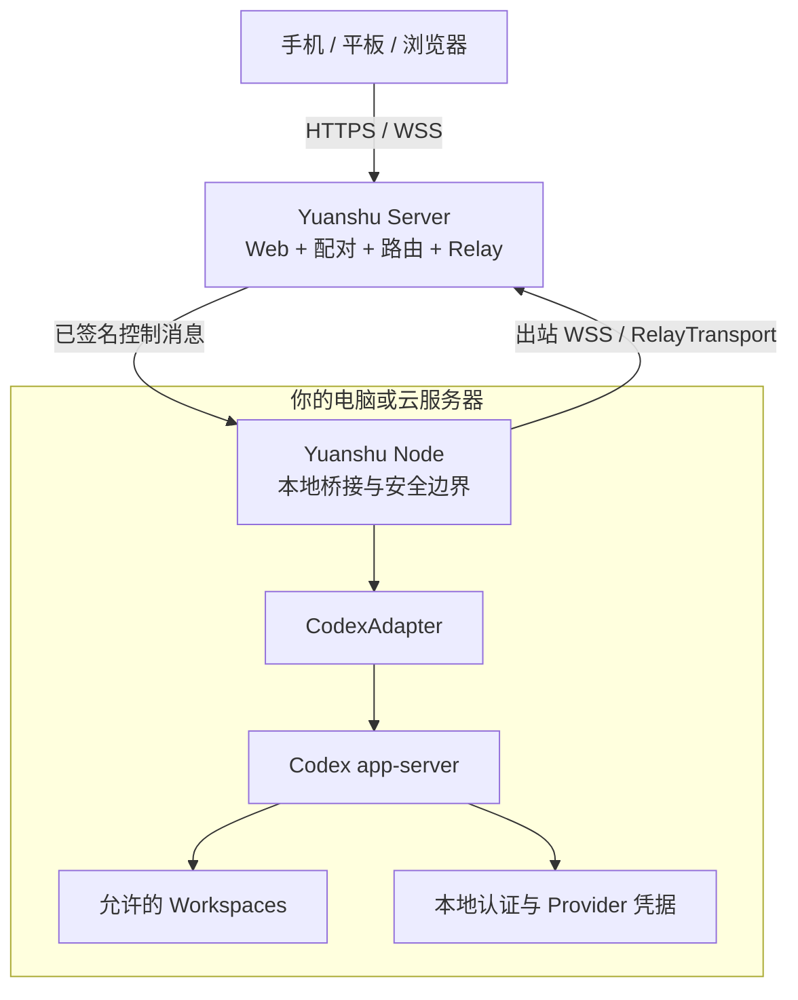

# Yuanshu · 远枢

> 面向本地 AI 编程 Agent 的开源远程工作台。

[English](./README.md) | [简体中文](./README.zh-CN.md)

[](./LICENSE)
[](#项目状态)
[](https://github.com/yuanshu-ai/yuanshu/actions/workflows/ci.yml)

远枢面向希望从手机、平板或浏览器控制自己电脑上 AI 编程 Agent 的开发者。它关注 Thread、流式输出、命令、Diff、审批和任务状态等结构化事件，而不是转发整个桌面画面。

“远枢”由“远程”和“中枢”组合而来：成为你已有设备与 Agent 的远程控制中心。

> [!IMPORTANT]
> 远枢目前处于 Pre-alpha 产品设计和技术验证阶段，尚无可安装版本。请勿使用当前项目将开发电脑直接暴露到公网。

## 为什么选择远枢？

- **一控多 Node**：从一个界面跟进个人电脑、工作电脑、常开设备或开发服务器上的任务。
- **认证方式中立**：复用每台 Node 机器上已经可用的 Codex 配置，无论使用 ChatGPT 登录、API Key 还是 Codex 支持的自定义 Provider。
- **本地执行、本地凭据**：模型请求、源代码、Shell、Git/SSH 凭据和 Agent 认证始终留在 Node 所在机器。
- **Agent 原生远程体验**：展示任务状态、流式事件、审批、命令和 Diff，而不是镜像桌面。
- **开放且可自托管**：Yuanshu Node、Server、Web、协议和 Adapter 均以可审计、可自托管为目标。
- **可扩展到多个 Agent**：首个 Adapter 面向 Codex app-server，后续通过显式能力适配更多本地编程 Agent。

## 个人 MVP 规划

第一个可用版本会严格收敛范围：

- 单 Owner 控制 1–5 个 Yuanshu Node；
- 首发 Windows 11 x64 Node；
- Linux amd64 Server 和 Standalone 作为首个自托管目标；
- Codex app-server 集成；
- 本地工作区白名单；
- 创建、列出、读取和恢复 Thread；
- 展示 Agent 消息、命令、工具活动、文件变化和 Diff；
- 向活动 Turn 追加指令或停止执行；
- 通过移动优先的 PWA 查看和处理审批；
- Control Client 对控制消息签名，Node 最终验证；
- Node 事件日志、断线重连、补发和 Snapshot 恢复；
- Server + Node 标准模式与单部署 Standalone 模式；
- 普通 Node 机器只需主动发起 HTTPS/WSS 出站连接。

团队角色、托管计算、远程桌面、通用 Web Terminal 和云端永久保存任务正文均不进入首个 MVP。

## 平台路线

Windows、macOS 和 Linux 都是确定支持的一等平台。为了控制首个版本范围，按以下顺序交付：

1. Windows 11 x64 Yuanshu Node；
2. Linux amd64 Yuanshu Server 和 Standalone；
3. Linux amd64 Yuanshu Node；
4. macOS arm64 Yuanshu Node；
5. 根据实际使用量提供 macOS amd64 和 Linux arm64 构建。

协议、Transport、Adapter、配置模型和事件日志共用同一套 Go 实现。平台专属代码仅包含安全存储、IPC、进程生命周期、自动启动、路径校验和发布签名。项目优先使用纯 Go 依赖；引入 CGO 必须先完成跨平台构建和供应链评审。

三目标平台共用的 Platform 合约现已建立。Windows 已提供当前用户 DPAPI 安全存储、基于目录句柄的工作区检查和直接用户态进程生命周期；其他尚未实现的生产能力继续安全失败。状态化内存 fake 覆盖安全存储、直接进程生命周期、逻辑本地 IPC、当前用户自动启动和工作区事实。Keychain、Secret Service、Named Pipe、Unix socket、Job Object、LaunchAgent 与 systemd 集成仍属于后续平台任务。工作区检查只报告操作系统事实，是否允许始终由 Node 策略层决定。

## 架构方向



远枢包含四个逻辑组件：Agent Runtime（首发 Codex，后续 Claude Code）、Yuanshu Node、Yuanshu Server，以及浏览器/PWA Control Client。Server 提供 Web、配对、注册、路由和 Relay；Node 仍是可信 Control Client、工作区边界、Sandbox 策略和审批的最终执行点。

规划中的运行模式为：

```text
yuanshu server       运行 Web、控制面与 Relay
yuanshu node         在 Agent 所在机器运行，并连接 Server
yuanshu standalone   在一个部署中运行 Server + Web + 本机 Node
```

`yuanshu node` 是正式的 Windows 当前用户会话 Alpha 入口：加载版本化本地配置、管理 Codex 子进程、提供当前用户专属管理管道和原生托盘。`yuanshu server` 提供正式元数据、配对和实时路由；`yuanshu standalone` 现在通过进程内 `StandaloneTransport` 组装该 Server 与本机 Node，Server 不导入或调用 Agent Runtime。不得把 Codex app-server 或其他 Agent 的内部接口直接暴露到公网。

## 项目状态

- [x] 产品范围与架构基线
- [x] 个人优先、一控多 Node 方向
- [x] Codex 认证方式中立定位
- [x] 可构建工作区、占位 CLI、Web 骨架与基础 CI
- [x] M0 Codex app-server 与最小纵向链路技术验证
- [x] Protocol v1 Schema、Go/TypeScript 生成类型与兼容夹具
- [x] JCS + Ed25519 控制消息编码与跨语言测试向量
- [x] Node 侧签名控制验证与原子防重放
- [x] Transport 合约与 Relay/Standalone 共享行为测试
- [x] 复用同一签名 Node 控制会话的正式 Standalone 组装
- [x] Windows/macOS/Linux Platform 合约、安全骨架与状态化 fake
- [x] Windows DPAPI 身份存储与本地工作区策略边界
- [x] Node 管理的 Codex stdio Runtime、正式 Adapter 合约与 Thread/Turn 所有权
- [x] 有界 Node 事件日志、cursor 补发、Snapshot 与 ambiguous 恢复
- [x] Windows Yuanshu Node Alpha
- [x] 三平台原生 CI、容器化 Linux race、依赖/Secret 扫描与 SBOM
- [x] 正式 loopback Server bootstrap 与 SQLite 元数据基线
- [x] 仅TLS的WSS Hub、认证RelayTransport与Owner/Node路由
- [x] 控制端短期配对、Node本地确认、凭据轮换与即时撤销
- [x] 单 Owner 最多五 Node、签名 Node enrollment、全局控制端信任与防串流
- [ ] Linux Server 与 Standalone 自托管预览版
- [ ] Linux Server 与真实手机自托管部署
- [ ] Linux Yuanshu Node
- [ ] macOS arm64 Yuanshu Node
- [ ] 移动 PWA 任务闭环
- [ ] 安全加固与首个公开预览版

路线图会先确保一个开发者能够稳定地每天使用，再完成已经确定的 Linux 和 macOS 集成，之后扩展更多 AgentAdapter 或团队功能。

## 本地开发

仓库同时包含保持隔离的 `m0-poc-1` Gate G0 实现和正式的内部 CodexAdapter 基础。正式 Adapter 使用 Node 管理的 stdio app-server、本地 workspace ID、有界事件、一次性审批和持久 Thread 所有权。Node SQLite 现已支持单调事件序号、有界保留、outbox cursor确认、补发、Snapshot，以及对不确定 Turn 的保守对账；仅TLS Hub已支持单个个人 Owner 下最多五台隔离 Node，由现有 Node签名批准五分钟 enrollment，并由每台 Node独立复核Owner全局Control Client信任。完整任务 PWA 仍在后续任务中。

参考开发工具链（仅作为建议，仓库不会强制锁定）：

- Go 1.26.5；
- Node.js 24.18.1；
- 通过 Corepack 使用 pnpm 11.18.0。

只要能够运行 Go 和 Web 工具链，也可以使用其它版本。Codex 兼容矩阵只
记录已经验证的组合并提供公开建议，不是运行时版本白名单。Yuanshu 会先
探测本机 Codex 版本并尝试初始化 app-server；如果实际协议或能力不匹配，
再以运行时能力错误明确报告。

在仓库根目录安装 Web 依赖：

```shell
corepack enable
corepack install --global pnpm@11.18.0 # 可选：使用已验证的 pnpm 版本
pnpm install --frozen-lockfile
```

运行本地验证：

```shell
go test ./...
go test ./internal/platform/... ./tests/contract/platform/...
go test ./internal/config/... ./tests/contract/config/...
go test ./internal/node/... ./tests/contract/node/...
go test ./internal/adapter/... ./tests/integration/codex/...
go vet ./...
go build ./...
pnpm --dir web test
pnpm --dir web build
```

正式 Protocol v1 Schema 是线上的唯一类型来源。可使用以下命令重新生成并检查提交的 Go/TypeScript 类型：

```shell
pnpm protocol:generate
pnpm protocol:check
pnpm protocol:test
```

协议生成同时需要 Node.js 与 Go（`gofmt`），并可在 Windows、macOS 和 Linux 上确定性执行。临时 `m0-poc-1` 帧与 Protocol v1 保持隔离。

### 正式 Node 配置

版本化 Node 配置合约使用严格 TOML，由 `schemas/config/v1/node-config.schema.json` 定义。当前只接受 `relay`、`standalone` 和 Codex `stdio`。设备、Relay 与代理凭据只能表示为不透明 SecretRef；配置文件不会包含凭据字节，安全存储不可用时也绝不降级为明文。

配置包支持原子替换、最近有效的 `.bak` 备份、显式恢复状态和脱敏 SecretRef 健康检查。Windows 上的配置工作区现在可以协调到 Node 本地 SQLite 策略库；远程调用方只使用不透明 workspace ID，canonical path、稳定文件身份、reparse point 检查及读写/网络权限上限始终留在本机。正式 CodexAdapter 现已消费该边界，其 Protocol v1 映射事件可与 outbox 一同写入本地 SQLite；cursor补发、history gap、Snapshot和保守 ambiguous恢复可跨 Node重启延续。默认操作系统路径、Runner组装、真实 Relay接线和设置界面仍属于后续任务。

查看不会启动服务的 CLI 帮助：

```shell
go run ./cmd/yuanshu --help
go run ./cmd/yuanshu server --help
go run ./cmd/yuanshu node --help
go run ./cmd/yuanshu standalone --help
```

### 正式 Server bootstrap

未提供 Server 配置文件时，最小 Server 要求显式绝对数据目录，并且只接受字面量 loopback 地址 `127.0.0.1` 或 `::1`：

```powershell
yuanshu server --data-dir C:\path\to\yuanshu-server --listen 127.0.0.1:7444
```

未初始化的数据目录首次启动时，Server 只向本地 stdout 显示一次 32 字节 bootstrap secret。待领取 Node 自己生成 Ed25519 密钥和连接凭据、在本地保留凭据正文，并仅向 `POST /v1/bootstrap/claim` 提交公钥和凭据 SHA-256。Server 在 `server.db` 中原子创建首个 Owner 与 Node，并在五分钟内支持完全相同的 claim 重试。HTTP初始化使用 `/healthz`、`/readyz`、`/v1/bootstrap/status` 和 `/v1/bootstrap/claim`；认证实时连接使用 `/node/connect` 与 `/web/connect`。

正式实时Handler强制TLS，使用Node连接凭据和Ed25519 challenge认证，并且不重新编码地路由Protocol v1原始帧。Server Schema v3新增只保存散列的五分钟附加Node enrollment和Owner信任revision；每台Node的连接凭据仍只保留在本机。配置后的非loopback Server使用下方的IP优先 HTTPS/WSS路径；`/pair` 与 WebSocket 端点不得在没有受信TLS时暴露。不得公开 Codex app-server 端口。

### 正式 Standalone 组装

Standalone 要求版本化 Node 配置使用 `transport.mode = "standalone"`，并显式提供绝对路径。它在所选数据目录下分别保存 `server/server.db` 与 `node/node.db`，把本机 Node 领取到未初始化的本地 Server，并让原始签名 Protocol v1 帧经过与 Relay 模式相同的 Node 验证器和分派器：

```powershell
yuanshu standalone --data-dir C:\path\to\yuanshu-standalone --config C:\path\to\config.toml --listen 127.0.0.1:7444
```

Standalone 默认仍只监听 loopback。通过 `--server-config` 可以使用与 Server 相同的 IP 优先 HTTPS/WSS 监听和 TLS 配置；Linux 进程/安全存储包装与产品容器属于后续里程碑。

### IP 优先的自托管

当前自托管路径优先支持局域网 IP，也可以使用域名，但浏览器连接始终必须使用 HTTPS/WSS。非 loopback Server 必须使用 SAN 包含配置 IP 的证书；不支持 `ws://`、明文 HTTP、公开 Codex app-server 端口或关闭 TLS 的开关。

Server 使用独立配置文件：

```toml
config_version = 1
data_dir = "/absolute/path/yuanshu-server"
listen = "0.0.0.0:7444"
public_url = "https://192.168.1.20:7444"
tls_cert_file = "/absolute/path/server.crt"
tls_key_file = "/absolute/path/server.key"
allowed_control_origins = ["https://192.168.1.20:4173"]
```

```shell
yuanshu server --config /absolute/path/server.toml
yuanshu server doctor --config /absolute/path/server.toml --json
```

Web 可以加载 `/yuanshu.config.json`，也可以在连接设置页面填写：

```json
{
  "relayUrl": "wss://192.168.1.20:7444/web/connect",
  "pairingUrl": "https://192.168.1.20:7444/pair"
}
```

浏览器只在 IndexedDB 保存连接地址和控制端身份。Node 设置以脱敏形式读取；Relay、代理、工作区和执行边界的变更需要 Node 本机确认。Server 监听/TLS 设置和凭据仍只能由本机配置文件或 CLI 管理。

仓库源文件统一使用 LF，以上命令面向 Windows、macOS 和 Linux。CI 在 Ubuntu 24.04 x64、Windows Server 2025 x64和 macOS 15 arm64原生运行 Go 门禁，并执行 Web/Protocol检查、固定容器中的 Linux race、依赖与 Secret扫描和 SPDX SBOM生成。成功的工作流会保留7天的 Windows amd64、Linux amd64和 Darwin arm64未签名构建工件；它们只是工程工件，不是可安装 Release，正式签名与产品容器镜像属于后续里程碑。

### M0 PoC（仅开发验证）

隔离的内部 M0 PoC 测试链路使用以下显式临时配置：

```text
YUANSHU_POC_LISTEN=127.0.0.1:7443
YUANSHU_POC_TLS_CERT=<localhost 证书 PEM>
YUANSHU_POC_TLS_KEY=<localhost 私钥 PEM>
YUANSHU_POC_NODE_TOKEN=<至少 32 个随机字节>
YUANSHU_POC_SERVER_URL=wss://localhost:7443
YUANSHU_POC_WORKSPACE=<已存在、非根目录的临时工作区>
```

`YUANSHU_POC_ARCHIVE_ON_CLOSE=1` 仅用于有界测试。这些变量不配置正式的 `yuanshu server`、`yuanshu node` 或 `yuanshu standalone` 命令。不得复用 PoC Token 或开发证书，也不得把 PoC 暴露到 loopback 以外。

### Windows Node Alpha

Windows 默认使用 `%LOCALAPPDATA%\Yuanshu\config.toml`。Node 运行在当前用户会话，提供原生托盘、当前用户专属 Named Pipe、Job Object进程树回收和显式 HKCU登录启动项。绑定后的 Relay Node 会建立出站WSS用于在线配对；新浏览器必须由本机CLI确认指纹，不能批准自己。托盘仍保持为薄入口。

```powershell
yuanshu node
yuanshu node status --json
yuanshu node doctor
yuanshu node pairing create
yuanshu node pairing list
yuanshu node pairing approve <pairing-id>
yuanshu node pairing reject <pairing-id>
yuanshu node clients list
yuanshu node clients revoke <client-id> <key-id>
yuanshu node credential rotate
yuanshu node enrollment create
yuanshu node enrollment list
yuanshu node enrollment approve <enrollment-id>
yuanshu node enrollment reject <enrollment-id>
yuanshu node enrollment join <join-url>
yuanshu node devices list
yuanshu node devices revoke <node-id>
yuanshu node autostart enable
yuanshu node autostart disable
yuanshu node stop
```

## 安全原则

远枢按照“高信任本地执行环境、最小信任 Server Relay”设计：

- Node 和 Control Client 使用独立设备身份；
- 控制操作和审批决定端到端签名，并由 Node 重新验证；
- 远程客户端不能指定任意本地路径；
- Server Relay 不永久保存提示词、回复、命令输出、Diff 或源代码；
- ChatGPT Token、API Key、Provider Key 和 Git/SSH 凭据不得上传到远枢；
- 崩溃后结果不明确的操作不得静默重放。

在对应实现和安全测试完成前，以上内容仍属于设计目标。首个可执行版本发布前会补充正式安全策略和私密漏洞报告渠道。

## 参与贡献

远枢仍处于早期阶段，以下反馈尤其有价值：

- Codex app-server 兼容性测试结论；
- Windows、Linux 和 macOS Node 生命周期实验；
- 协议与威胁模型评审；
- 移动端任务和审批体验建议；
- 自托管使用反馈；
- 跨平台集成结论或第二 AgentAdapter 的需求研究。

请使用 GitHub Issues 提交可复现问题、范围明确的提案和设计讨论。不要在公开 Issue 中发布凭据、私有代码或安全漏洞细节。

正式贡献指南和安全报告流程将在实现开始时补充。

## 许可证

远枢使用 [Apache License 2.0](./LICENSE) 开源。

## 致谢与声明

首个集成方案基于开源的 [OpenAI Codex](https://github.com/openai/codex) app-server 协议。

远枢是独立开源项目，与 OpenAI 不存在隶属或官方认可关系。文中产品名和公司名分别属于其权利所有者。
