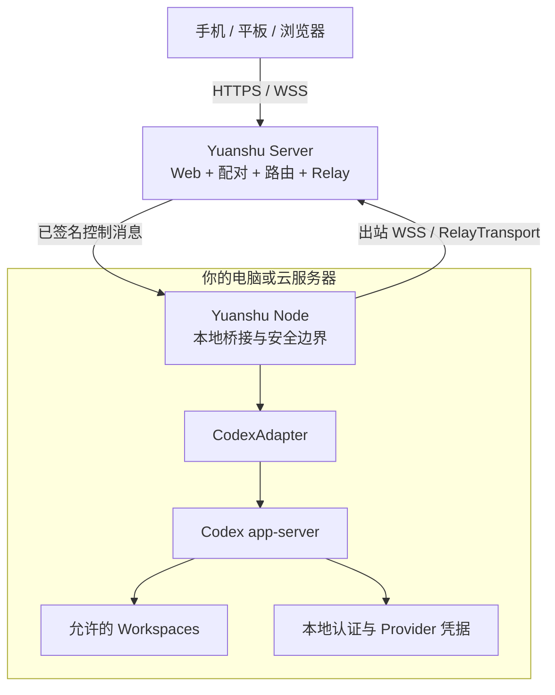

# Yuanshu · 远枢

> 面向本地 AI 编程 Agent 的开源远程工作台。

[English](./README.md) | [简体中文](./README.zh-CN.md)

[](./LICENSE)
[](#项目状态)

远枢面向希望从手机、平板或浏览器控制自己电脑上 AI 编程 Agent 的开发者。它关注 Thread、流式输出、命令、Diff、审批和任务状态等结构化事件，而不是转发整个桌面画面。

“远枢”由“远程”和“中枢”组合而来：成为你已有设备与 Agent 的远程控制中心。

> [!IMPORTANT]
> 远枢目前处于 Pre-alpha 产品设计和技术验证阶段，尚无可安装版本。请勿使用当前项目将开发电脑直接暴露到公网。

## 为什么选择远枢？

- **一控多 Node**：从一个界面跟进个人电脑、工作电脑、常开设备或开发服务器上的任务。
- **认证方式中立**：复用每台 Node 机器上已经可用的 Codex 配置，无论使用 ChatGPT 登录、API Key 还是 Codex 支持的自定义 Provider。
- **本地执行、本地凭据**：模型请求、源代码、Shell、Git/SSH 凭据和 Agent 认证始终留在 Node 所在机器。
- **Agent 原生远程体验**：展示任务状态、流式事件、审批、命令和 Diff，而不是镜像桌面。
- **开放且可自托管**：Yuanshu Node、Server、Web、协议和 Adapter 均以可审计、可自托管为目标。
- **可扩展到多个 Agent**：首个 Adapter 面向 Codex app-server，后续通过显式能力适配更多本地编程 Agent。

## 个人 MVP 规划

第一个可用版本会严格收敛范围：

- 单 Owner 控制 1–5 个 Yuanshu Node；
- 首发 Windows 11 x64 Node；
- Codex app-server 集成；
- 本地工作区白名单；
- 创建、列出、读取和恢复 Thread；
- 展示 Agent 消息、命令、工具活动、文件变化和 Diff；
- 向活动 Turn 追加指令或停止执行；
- 通过移动优先的 PWA 查看和处理审批；
- Control Client 对控制消息签名，Node 最终验证；
- Node 事件日志、断线重连、补发和 Snapshot 恢复；
- Server + Node 标准模式与单部署 Standalone 模式；
- 普通 Node 机器只需主动发起 HTTPS/WSS 出站连接。

团队角色、托管计算、远程桌面、通用 Web Terminal 和云端永久保存任务正文均不进入首个 MVP。

## 架构方向



远枢包含四个逻辑组件：Agent Runtime（首发 Codex，后续 Claude Code）、Yuanshu Node、Yuanshu Server，以及浏览器/PWA Control Client。Server 提供 Web、配对、注册、路由和 Relay；Node 仍是可信 Control Client、工作区边界、Sandbox 策略和审批的最终执行点。

规划中的运行模式为：

```text
yuanshu server       运行 Web、控制面与 Relay
yuanshu node         在 Agent 所在机器运行，并连接 Server
yuanshu standalone   在一个部署中运行 Server + Web + 本机 Node
```

这些命令是规划接口，当前 Pre-alpha 仓库尚不能直接运行。如果云服务器同时运行 Codex 或其他受支持 Agent，只需部署一个 Standalone，不需要再搭建第二套中转服务。Standalone 内部仍必须通过 Node 模块访问本机 Agent，Server 不能绕过本地策略和审批。不得把 Codex app-server 或其他 Agent 的内部接口直接暴露到公网。

## 项目状态

- [x] 产品范围与架构基线
- [x] 个人优先、一控多 Node 方向
- [x] Codex 认证方式中立定位
- [ ] Codex app-server 技术验证
- [ ] 跨语言协议和控制签名测试向量
- [ ] Windows Yuanshu Node Alpha
- [ ] 自托管 Server、Standalone 与设备配对
- [ ] 移动 PWA 任务闭环
- [ ] 安全加固与首个公开预览版

路线图会先确保一个开发者能够稳定地每天使用，再增加更多操作系统、AgentAdapter 或团队功能。

## 安全原则

远枢按照“高信任本地执行环境、最小信任 Server Relay”设计：

- Node 和 Control Client 使用独立设备身份；
- 控制操作和审批决定端到端签名，并由 Node 重新验证；
- 远程客户端不能指定任意本地路径；
- Server Relay 不永久保存提示词、回复、命令输出、Diff 或源代码；
- ChatGPT Token、API Key、Provider Key 和 Git/SSH 凭据不得上传到远枢；
- 崩溃后结果不明确的操作不得静默重放。

在对应实现和安全测试完成前，以上内容仍属于设计目标。首个可执行版本发布前会补充正式安全策略和私密漏洞报告渠道。

## 参与贡献

远枢仍处于早期阶段，以下反馈尤其有价值：

- Codex app-server 兼容性测试结论；
- Windows Node 生命周期实验；
- 协议与威胁模型评审；
- 移动端任务和审批体验建议；
- 自托管使用反馈；
- 第二操作系统或第二 AgentAdapter 的需求研究。

请使用 GitHub Issues 提交可复现问题、范围明确的提案和设计讨论。不要在公开 Issue 中发布凭据、私有代码或安全漏洞细节。

正式贡献指南和安全报告流程将在实现开始时补充。

## 许可证

远枢使用 [Apache License 2.0](./LICENSE) 开源。

## 致谢与声明

首个集成方案基于开源的 [OpenAI Codex](https://github.com/openai/codex) app-server 协议。

远枢是独立开源项目，与 OpenAI 不存在隶属或官方认可关系。文中产品名和公司名分别属于其权利所有者。
