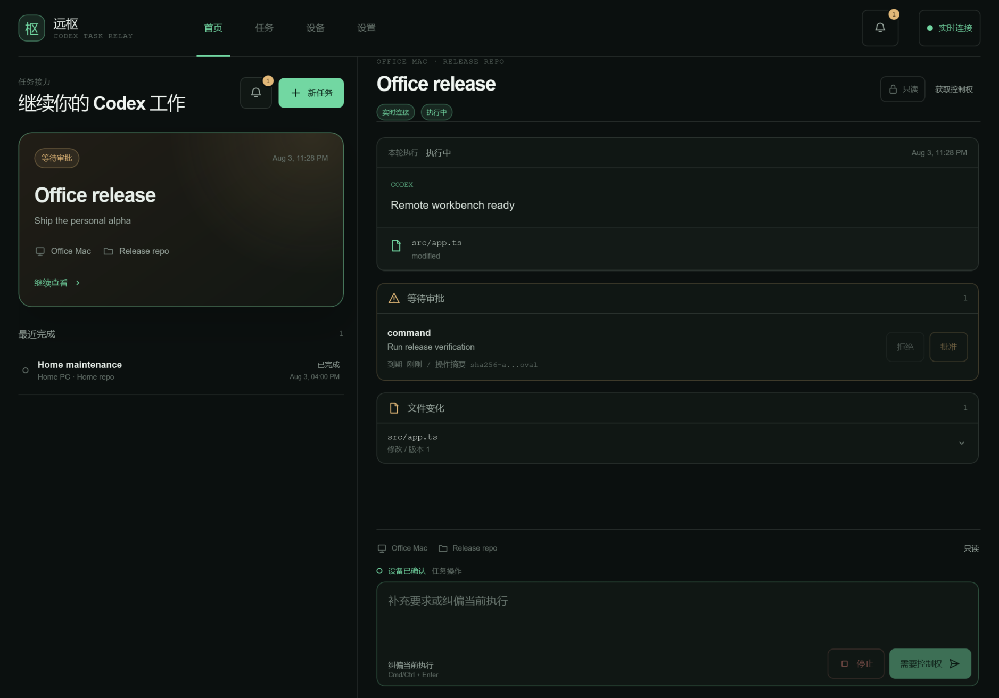
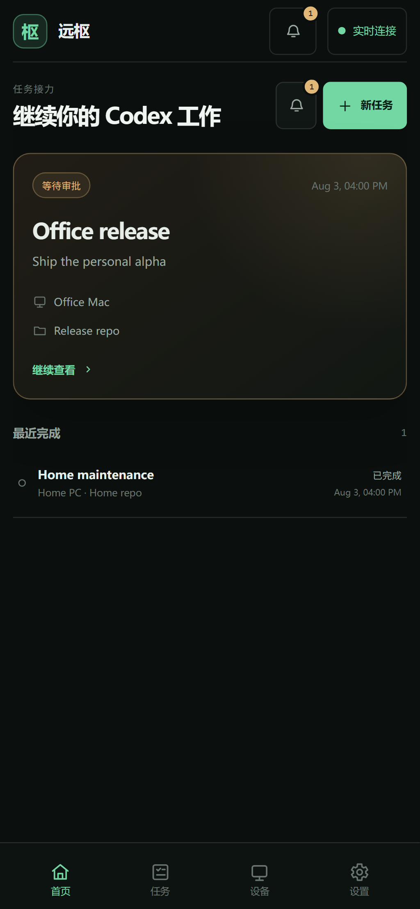
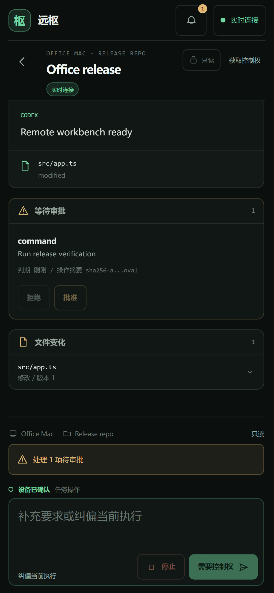
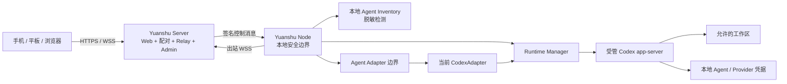

# Yuanshu · 远枢

<p align="center"></p>

> 面向运行在个人电脑上的 AI 编程 Agent 的开源远程工作台。

[English](./README.md) | [简体中文](./README.zh-CN.md)

[](./LICENSE)
[](#项目状态)
[](https://github.com/yuanshu-ai/yuanshu/actions/workflows/ci.yml)

远枢让你从手机、平板或浏览器跟进和控制运行在个人电脑上的 Codex。它把用户实际使用的 Codex 环境——包括 API Key 认证、自定义 Base URL、模型 Provider 网关、代理、MCP 和本地工具——留在 Node 电脑上，并展示 Agent 原生状态，而不是镜像整个桌面。

Codex 是第一个完整集成。长期产品是面向本地 Coding Agent 的开源、自托管远程工作台，后续计划通过 Adapter 接入 Claude Code、OpenCode、Gemini、Grok Build、Zcode、WorkBuddy 等结构化 Agent Runtime。



| 手机任务首页 | 手机任务详情 |
| --- | --- |
|  |  |

<!-- readme-section: status -->
## 项目状态

> [!WARNING]
> 远枢目前处于 **Pre-alpha，且只支持从源码构建**。尚无签名安装包或受支持的生产版本。PF-052 对 macOS、Windows、iPhone、Android、iPad 和网络切换的真实设备验收仍在进行中。请勿使用当前构建把开发电脑直接暴露到公网。

当前实现可以用于开发和自托管评估。Protocol、Web、Go、跨平台构建、防重放、TLS 和证书 Provider 已有自动化测试，但这些测试不能替代真实设备发布验收。

<!-- readme-section: capabilities -->
## 当前可用能力

- 一个个人 Owner 可以绑定并切换多个 Yuanshu Node。
- Windows 和 macOS Node 在本机运行 Codex app-server，Agent 凭据始终留在对应电脑。
- 使用 API Key 或自定义 Provider 的 Codex 继续保留本机 Base URL、认证、代理、MCP 和工具环境，同时可以从 Web 工作台控制。
- 移动优先 Web 工作台可以列出工作区和 Thread、读取历史、接收流式事件、启动或引导 Turn，并停止活动任务。
- Thread 级租约防止两个浏览器同时修改同一任务。
- 已实现签名审批、命令/工具活动、文件变化、有界 Diff、通知和断线恢复。
- Node 事件日志支持游标补发、Snapshot、历史缺口恢复和不确定操作的保守处理。
- Server 在一个进程中内嵌工作台、配对页、Relay 和同源管理后台。
- 四种自托管模式覆盖本机 loopback、局域网托管证书、公网 IP ACME，以及已有证书或同机反向代理。
- Node 已使用静态 Adapter Registry、脱敏本地 Agent Inventory 和相互隔离的多 Runtime Manager；正式运行路径仍是 `codex-default` managed stdio。
- 仓库包含仅用于架构验证的 Claude Code 与 OpenCode Probe，但它们没有注册为正式 Adapter，也没有开放远程任务控制。

远枢当前首先集成 Codex。Server 不代理模型 API，也不要求 Agent 必须使用某个厂商移动端账户链路。当前不提供托管算力、远程桌面、通用 Web Terminal、Server 永久任务正文存储、团队 ACL 或其它正式 Agent Adapter。

<!-- readme-section: quick-start -->
## 从源码快速开始

### 前置条件

- 能够构建仓库的 Go 和 Node.js；仓库中的 `.go-version` 与 `.node-version` 记录当前已验证工具链。
- 通过 Corepack 使用 pnpm。
- 每台 Node 电脑上已经安装并能够正常认证的 Codex。
- Windows 或 macOS 当前用户会话；不要以 root、LocalSystem 或系统级守护进程运行 Node。

远枢不会仅因为 Codex、Node.js 或浏览器版本未出现在兼容表中就拒绝运行。未知 Codex 版本会在运行时探测，并在能力不一致时显示 `unverified`、`partial` 或 `unavailable`。

### 构建

```shell
git clone https://github.com/yuanshu-ai/yuanshu.git
cd yuanshu
corepack enable
pnpm install --frozen-lockfile
pnpm build
mkdir -p bin .local
go build -o ./bin/yuanshu ./cmd/yuanshu
```

Windows 请构建 `bin\yuanshu.exe`，并在下面的命令中使用 Windows 绝对路径。

### 在同一台电脑试用

运行本机 Server 设置向导并选择 `local`：

```shell
./bin/yuanshu server setup --config "$PWD/.local/server.toml"
./bin/yuanshu server --config "$PWD/.local/server.toml"
```

在另一个终端配置并启动 Node：

```shell
./bin/yuanshu node setup
./bin/yuanshu node
```

Server 会输出本机工作台、管理后台、配对页和 bootstrap 地址。打开 `/pair`，在可信 Node 上批准配对，选择已允许的工作区，然后创建第一个任务。

只有字面量 `127.0.0.1` 和 `::1` 可以使用 HTTP/WS。Host 和对端检查会阻止局域网或公网客户端利用这个例外。

### 从局域网手机访问

运行 `server setup`，选择 `lan-managed`，再选择 Server 电脑的稳定私有 IP。远枢会创建每 Server 独立 CA 和包含 IP SAN 的叶证书。在每台设备上核对显示的指纹，打开 `/trust`，安装公开根证书，并在 `node setup` 时为 Node 配置同一个 CA。

CA 私钥永远不会离开 Server 私有数据目录。连接其他设备前请阅读[自托管与局域网 TLS 指南](./guides/self-hosting.md)。

<!-- readme-section: deployment -->
## 部署模式

| 模式 | 浏览器和 Relay 访问 | 证书来源 | 适用场景 |
| --- | --- | --- | --- |
| `local` | 字面量 loopback HTTP/WS | 无 | 同一电脑评估和本机设置 |
| `lan-managed` | 私有 IP HTTPS/WSS | 每 Server 独立托管 CA | 家庭和办公室局域网，个人使用推荐 |
| `public-ip-acme` | 公网 IP HTTPS/WSS | 自动申请短期 ACME 证书 | 固定全局可路由 IP；仍需 staging 验收 |
| `external` | HTTPS/WSS | 用户证书或同机 loopback 反向代理 | 域名、企业 PKI、Caddy 或 Nginx |

所有远程访问都必须使用 TLS。远枢不提供关闭证书或主机名校验的开关，也绝不把 Codex app-server 作为公网端点公开。

<!-- readme-section: platforms -->
## 平台与验收矩阵

| 目标 | 实现状态 | 自动化证据 | 真实设备/发布证据 |
| --- | --- | --- | --- |
| Windows x64 Node | 已实现 DPAPI、Named Pipe、Job Object、原生托盘和用户级自启动 | 原生 CI 与交叉构建覆盖 | PF-052 Windows 日常使用验收待完成 |
| macOS arm64 Node | 已实现 Keychain、Unix IPC、进程组、AppKit 菜单和 LaunchAgent | 原生构建与测试覆盖 | PF-052 完整 Node/菜单/LaunchAgent 验收待完成 |
| Linux amd64 Server/Standalone | 已实现且可构建 | Linux 测试、race、容器和交叉构建覆盖 | 真实自托管手机部署待完成 |
| Linux Node | 已有平台边界 | 合约测试覆盖 | 尚不是受支持的通用 Node |
| 移动 Web 工作台 | 已实现响应式浏览器界面 | Chromium/WebKit 视口和工作流测试 | 真实 Safari、Android Chrome 和 iPad 验收待完成 |
| 公网 IP ACME | 已实现 TLS-ALPN-01 和自动续期 | 可控 ACME/Provider 测试 | 真实 staging 和 production 签发待完成 |

此表刻意区分代码实现、自动化测试和真实设备验收。已验证组合见 [Codex 兼容矩阵](./guides/codex-compatibility.md)；它只是建议，不是运行时版本白名单。

<!-- readme-section: architecture -->
## 工作原理



Server 负责身份认证、个人路由、租约和不可变 Protocol v1 帧转发，不能绕过 Node 控制 Agent Runtime。Node 始终是控制端签名、防重放、工作区 ID、本地路径、权限、审批和 Agent 进程所有权的最终执行边界。

远枢使用一个二进制提供三个入口：

```text
yuanshu server       Web、配对、管理后台、控制面和 Relay
yuanshu node         本地桥接和 Agent 安全边界
yuanshu standalone   在一个部署中运行 Server + Web + 本机 Node
```

<!-- readme-section: data-boundaries -->
## 安全与数据边界

| 数据 | Node 电脑 | Server | 浏览器 |
| --- | --- | --- | --- |
| Agent 登录、API Key、自定义 Base URL 凭据、Git/SSH 凭据 | 留在本地 Agent 或操作系统安全存储 | 不保存 | 不保存 |
| Node 身份与会话 | Ed25519 私钥保存在操作系统安全存储；短期会话仅在内存 | 公钥与撤销元数据；短期会话仅在内存 | 不保存 |
| Thread 正文、命令输出和 Diff | Runtime 与有界本地恢复状态 | 不永久保存 | 仅内存投影 |
| 控制端私钥 | 不保存 | 只保存公钥 | IndexedDB 中不可导出的 CryptoKey |
| 工作区路径 | 本地规范化配置与策略存储 | 只接收不透明工作区 ID | 只接收不透明 ID 和显示名称 |
| 通知与审计 | 本地任务来源 | 只保存脱敏引用和摘要 | 认证后查看 |

控制和审批端到端签名，并由 Node 重新验证。远程调用者不能提交任意本机路径。断线重连不会自动重复具有副作用的 Turn 或审批操作；结果不确定时会保持可见，而不是显示为成功。

安全漏洞必须通过 [GitHub 私密漏洞报告](https://github.com/yuanshu-ai/yuanshu/security/advisories/new)提交，不能使用公开 Issue。测试或报告前请阅读 [SECURITY.md](./SECURITY.md)。

<!-- readme-section: limitations -->
## 当前限制与路线

- 尚无签名安装包、软件包仓库、稳定迁移承诺或生产支持。
- PF-052 真实设备和网络切换验收通过后，才会决定是否发布 `v0.1.0-alpha`。
- LAN Managed 设备仍需要用户在操作系统中明确安装并信任 Server 公共根 CA。
- 公网 IP ACME 需要全局可路由固定 IP 和公网 TCP 443。
- Linux Node、可安装 PWA、Web Push、团队角色、多租户托管和其他 Agent Adapter 属于后续能力。
- 当前不能附着外部 Codex CLI/Desktop 会话：现有证据没有证明可靠的跨进程会话发现和历史读取。
- 持久化 Agent Instance、Runtime Endpoint、稳定 Yuanshu Task Binding、远程 Agent 导航和 Protocol 能力协商尚未实现。
- Server 仍是个人单 Owner 控制面，不永久保存任务正文。

项目会先完成个人远程 Codex 闭环，再扩展小团队权限或商业多租户。Registry、Inventory 和 Runtime Manager 基础已经实现；持久化与公开 Protocol/Web 资源仍受明确证据 Gate 阻塞。检测到进程或存在 Probe 证据，绝不能被展示为可远程控制的 Agent。

<!-- readme-section: documentation -->
## 文档

- [公开指南索引](./guides/README.md)
- [IP-first 自托管与 LAN TLS](./guides/self-hosting.md)
- [配置参考](./guides/configuration.md)
- [Node 本地控制中心](./guides/node-control-center.md)
- [个人 Web 工作台](./guides/web-workbench.md)
- [Server 管理后台](./guides/server-admin.md)
- [Codex 兼容矩阵](./guides/codex-compatibility.md)
- [Agent 平台演进方向](./guides/agent-platform.md)
- [Protocol 与配置 Schema](./schemas/README.md)
- [测试布局与 M0 PoC 说明](./tests/README.md)

<!-- readme-section: development -->
## 本地开发

安装依赖并运行标准检查：

```shell
corepack enable
pnpm install --frozen-lockfile
pnpm readme:check
pnpm protocol:test
pnpm protocol:check
pnpm --dir web test --run
pnpm --dir web build
pnpm --dir node-web test --run
pnpm --dir node-web build
go test ./...
go test -race ./...
go vet ./...
go build ./...
```

Protocol v1 Schema 是 wire format 的唯一事实来源。平台专属的安全存储、IPC、进程所有权、自启动和路径检查都封装在 Platform 抽象之后。修改 Protocol、持久化、信任边界或生成产物前，请阅读 [CONTRIBUTING.md](./CONTRIBUTING.md)。

<!-- readme-section: community -->
## 社区

- 使用 [GitHub Issues](https://github.com/yuanshu-ai/yuanshu/issues)提交可复现 Bug 和范围明确的功能建议。
- 支持范围和诊断方式见 [SUPPORT.md](./SUPPORT.md)。
- 提交 Pull Request 前请阅读 [CONTRIBUTING.md](./CONTRIBUTING.md)。
- 社区参与遵循 [CODE_OF_CONDUCT.md](./CODE_OF_CONDUCT.md)。
- 安全漏洞只能通过 [SECURITY.md](./SECURITY.md)中的私密流程报告。

<!-- readme-section: license -->
## 许可证与声明

远枢使用 [Apache License 2.0](./LICENSE)。

首个集成基于开源 [OpenAI Codex](https://github.com/openai/codex) app-server 协议设计。远枢是独立开源项目，与 OpenAI 没有关联，也未获得其认可。产品和公司名称是各自所有者的商标。
